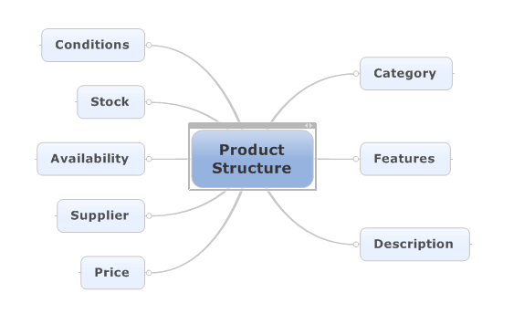
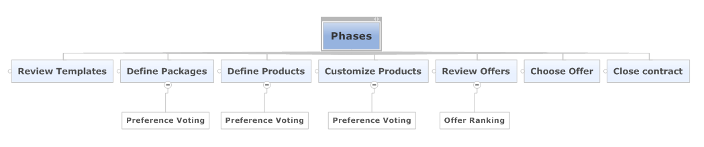
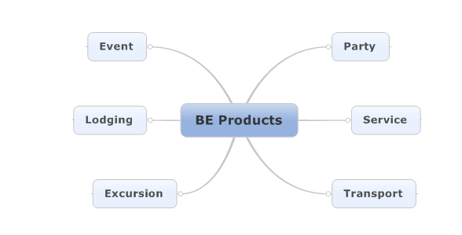
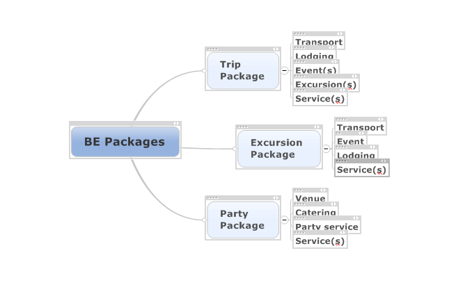

Development phase
======

### Definition

The Development phase is part of BE lifecycle. It starts when the group grants visibility to its product definitions to potential suppliers and it ends when one of them is chosen as the actual supplier.

#### Description
The following conditions should be met to allow this phase to start.

* The product's potential structure should have been already defined to a certain point. This is done by using products templates, based on actual offers of different suppliers (names not shown to users?) including conditions and prices.

    1. Product's category
    2. Product's features
    3. Conditions

**Note.** Some items of this list might include different alternatives. In this case all alternatives must have already been voted as preferences. 
    
* A decision should have been taken regarding the reception of offers. (Offers policy)
    1. Any supplier can see the group's product requirement and submit offers.
    2. A list of pre-selected suppliers can see the group's product requirement and submit offers. 

On the other hand, provided the necessary minimmum conditions are fulfilled, the group should be able to decide when to start sharing information with potential suppliers. 

Once the phase is started, suppliers and members of the group share information regarding suppliers offers and alternatives. The purpose of this phase is to enable the group to make the best informed decision possible.

#### Attributes
N/A

### Processes related to this concept

* Preceding and following phases of Bulkaria lifecycle

    * Incubacion (previous phase)
    * Produccion (next phase)

* Offers Blackboard processes
* Blackboard Pick processes
* Group wall processes

### Relationships with other concepts

* BE lifecycle Phases [BE Lifecycle](../BE_lifecycle.md) 
* Wall
* Offers Blackboard
* Group Blackboard
* Products templates

### Examples 

Provide some concrete examples whenever possible
* Example 
* ...
* Example

#### Appendix

##### Fig 1. Product Structure

##### Fig 2. BE Life Cycle

##### Fig 3. BE Products

##### Fig 4. BE Packages

